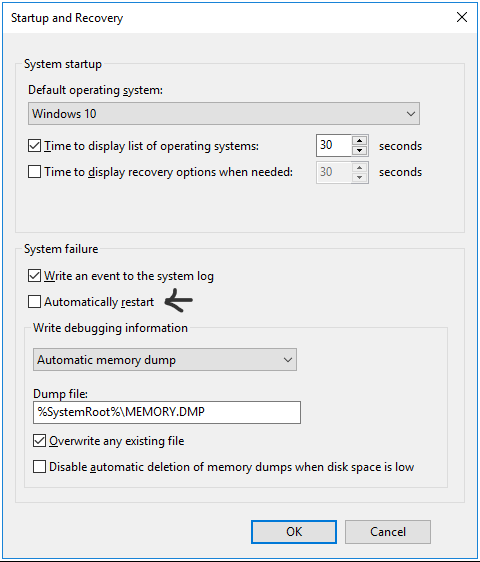
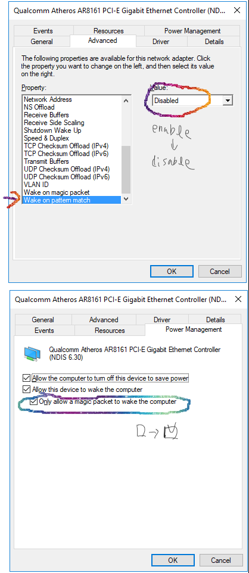

# 윈도우 10에서 시스템 종료를 해서 컴퓨터가 꺼젔는데 다시 켜지는 증상 해결.
하단의 설명처럼 설정을 변경하니까 10일이 지나도 한번도 다시 켜지지 않아서 해결된 것으로 보고 포스팅 합니다.  
## 증상
시스템을 종료하자마자 다시 켜짐. 매번 그런건 아님.  
혹시나 해서 시스템 오류시 자동 시작이 설정 되어 있는지 확인을 해봤지만  
이미 자동 시작은 해제한 상태임.  
  
## 설정 변경
윈도우 10에서는 2가지 방식으로 Wake On Lan방식을 사용한다고함. 그중에서 pattern match방식이 다시 컴퓨터를 켜는 오동작을 할 가능성이 많다고 한다.  
그래서 WOL을 끄는 것도 방법이지만, 현재 원격으로 컴퓨터를 키려고 WOL를 쓰고 있다. 그래서 아래와 같이 pattern match는 끄고 magic packet방식은 그대로 켜놓음.  
  
## 결과
설정하고 10일이 지나도 이전과 같이 오동작을 해서 다시 켜지거나 하지는 않음. 물론 WOL기능은 잘됨.  
이제 다시 켜진다고 강제로 파워서플라이의 스위치를 내리지 않아도 된다.  
## 관련 링크
[https://gyeongsang.kr/870](https://gyeongsang.kr/870)  
