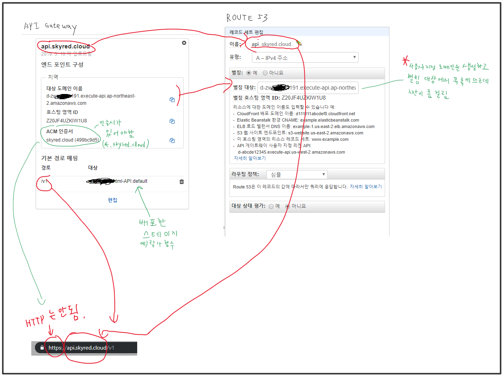

# API Gateway에서 API에 대한 리전 사용자 지정 도메인 이름 설정

## 요약
1. 도메인에 대한 인증서가 있어야됨.  
2. 레코드 세트를 추가할때 별칭 대상의 목록에 시간이 지나야 뜸.  
3. 생성한 API의 도메인에 https로 연결해야함. 

## 본문
**리전 사용자 지정 도메인**으로 엔드 포인트를 구성함. 그래서 API Gateway와 Certificate Manager는 **같은 리전**으로 함. 그러니까 배포한 API와 AWS에서 생성한 인증서가 같은 리전에 있게된다.  
엔드 포인트는 REST API로 구성.  
Route 53에서 레코드 세트를 작성할때 이름을 사용자 지정 도메인에서 작성할때와 같은 이름으로 생성해야 한다. 별칭 대상을 입력할 때는 대상 도메인 이름이 목록에 뜨는데 해당하는 것을 입력하면 된다. 그런데 사용자 지정 도메인 이름을 생성하고 나서 시간이 좀 지나야 대상 도메인 이름이 별칭 대상에 목록으로 뜬다.  
또한 반드시 인증서가 있어야 한다. 그리고 주소 표시줄에서 HTTPS도 입력 해야 한다.  

## 그림
  

## 인증서
인증서를 생성할때는 편의상 SVN을 skyred.cloud와 *.skyred.cloud에서 사용하는 것으로 만들었다.  
별표 표시는 어떤 글자가 들어가도 상관 없기 때문에 나중에 필요한 레코드를 생성해도 하나의 인증서로 쓸수 있다.  

## AWS 메뉴얼
[API Gateway에서 API에 대한 사용자 지정 도메인 이름 설정](https://docs.aws.amazon.com/ko_kr/apigateway/latest/developerguide/how-to-custom-domains.html)  
