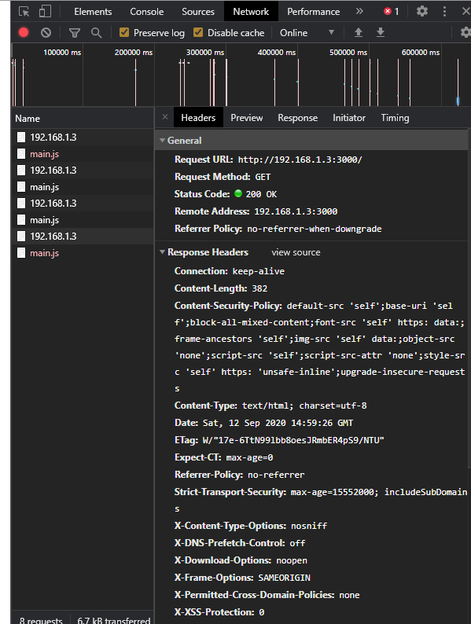

<link rel="stylesheet" href="/global.css">

# http 서버에서 ERR_SSL_PROTOCOL_ERROR

## 원인
Content-Security-Policy에 upgrade-insecure-requests가 설정 되어 있기 때문.  
  
해더에 위와같이 서버가 보내면 브라우저에서 자동으로 http를 https로 변경해서 호출한다.  
## disable
node에서 다음과 같이 설정해서 Content-Security-Policy를 설정하지 않는다.  
```js
var app = express();
var helmet = require('helmet')
app.use(helmet({
  contentSecurityPolicy:false,
}));
```
## 기타
- 로컬에서 오류 재현할때 서버에 localhost대신 ip주소를 직접 입력해야 한다.  
- ssl를 사용하는 https서버면 다른 방법을 써야 한다.  
