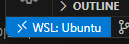

<link rel="stylesheet" href="/global.css">

# Docker로 github page를 로컬에서 보기
github page는 커밋된 md파일을 html으로 변환을 한다. 하지만 수정을 하는 도중에 확인을 하고 싶을 때는 커밋을 하고나서 github page가 업데이트 될 때 까지 기다려야 한다. 그래서 로컬에서 편집을 한 것을 바로 확인하고 싶어젔다.  

## 환경
- Windows 11에 WSL(Windows Subsystem for Linux)를 설치
- WSL에 도커를 설치

## 설정
윈도우에 바로 도커를 설치하는 대신에 WSL을 설치하고 WSL상에서 도커를 설치하고 jekyll 이미지를 실행하기로 했다.  
[jekyll 페이지](https://github.com/envygeeks/jekyll-docker/blob/master/README.md#server)에서는 docker run으로 실행하는 명령어를 보여준다. 그래서 ChatGPT에게 물어서 명령어를 docker compose에서 실행하는 yaml로 변환을 요청했다. 그리고 해당 변환하는 옵션을 뺴거나 더해서 최종적으로 `docker-compose.yml`파일을 작성했다. 그러면서 도중에 `Gamfile`를 지운것을 모르고 30분동안 삽질한 것 같다.  

### vscode 실행
처음에는 윈도우에서 vscode로 편집을 했다. 그러다가 jekyll을 WSL에서 이용하기 때문에 vscode도 WSL상에서 편집을 하기로 했다.  
github 페이지 폴더가 `C:\source\github-page`인 경우 WSL를 실행한 상태에서 `/mnt/c/github-page`로 이동한다. 그리고 WSL에서 `code .`를 실행하면 vscode가 실행된다. 그리고 실행된 vscode창의 왼쪽 하단에 보면 WSL로 연결되었다고 나타난다.  
  

### git
jekyll을 실행하면 여러 임시 폴더를 만든다. 실행하고 확인을 해보면 `C:\source\github-page\_site` 폴더가 생성이 되어 있다. 그래서 해당 폴더는 자동으로 생성되기 때문에 굳이 git에 저장되지 않도록 `.gitignore`에 `_site/`을 추가했다.  

vscode를 실행하면 거의 모든 파일이 변경되었다고 나와서 당황하게 하는 경우가 있다. 윈도우와 리눅스는 텍스트 파일에서 줄 바꿈을 표현하는 개행문자를 지정하는 방식이 다르다. 그래서 이번 경우에는 윈도우에서 저장한 텍스트 파일을 대상으로 발생한 현상이다.  
그래서 `.gitattributes`파일에 `* text=auto`를 지정을 해서 개행문자가 변경된 것은 변경되었다고 나오지 않게 설정을 했다.  

### docker compose
`docker-compose.yml` 파일은 다음과 같이 작성한다. 그리고 `/mnt/c/github-page`에 저장하면 된다.  
```yaml
services:
  jekyll:
    image: jekyll/jekyll
    container_name: jekyll_serve
    ports:
      - "4000:4000"
    volumes:
      - .:/srv/jekyll:Z
    command: jekyll serve
    working_dir: /srv/jekyll
    user: root
```
container_name은 마음에 드는 이름으로 정하면 된다. jekyll이 콘솔을 출력할때 지정한 이름을 앞 부분에 보여준다.  
jekyll은 기본적으로 4000번 포트를 사용한다. 포트를 `4000:4000` 으로 설정을 해서 `localhost:4000`으로 접속을 하면 브라우저에서 페이지를 확인할 수 있다. WSL상에서 실행을 했기 때문에 별다른 설정을 하지 않으면 localhost로만 접속이 가능하다.  
볼륨(volumes)과 작업 폴더(working_dir)는 현재 폴더로 지정을 해서 jekyll이 컨테이너 밖에 있는 데이터를 접근할 수 있게 했다.  
실행하려면 WSL상에서 `/mnt/c/github-page`에서 `docker compose up`을 실행한다. 필요하면 sudo를 앞에 붙이면 된다.  
