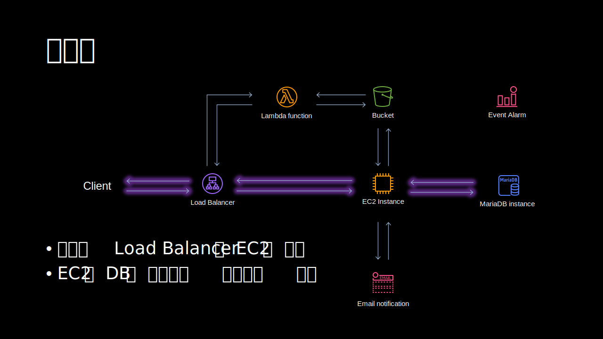
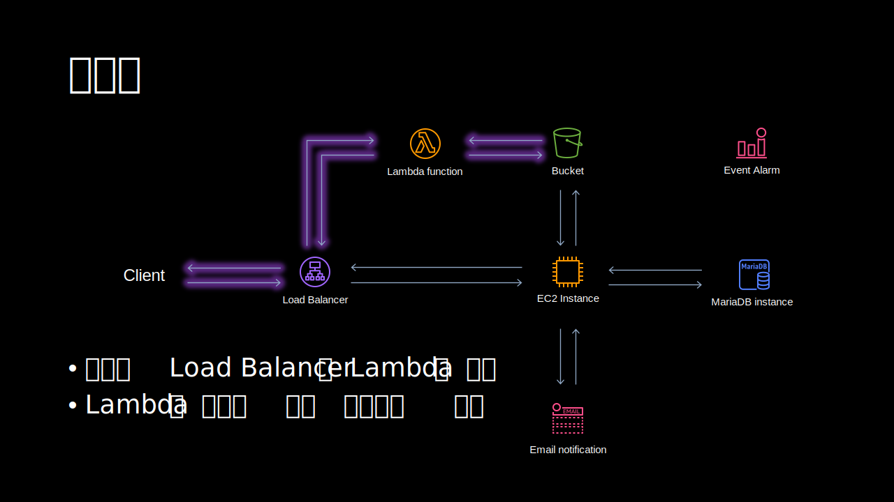

<link rel="stylesheet" href="/global.css">

# 에러 페이지 응답하기 (AWS)
## 평상시
  
EC2는 HTML 페이지랑 DB에서 가지고 온 데이터를 가공해서 API형태로 응답한다.  
로드밸런서의 역할은 요청하는 경로나 기타 조건을 보고 트래픽을 EC2나 Lambda로 분배한다.  

Lambda함수를 추가한다. 점검중이라는 페이지를 리턴하게 한다. 람다로 리턴을 하면 DB의 데이터를 참고하거나 워드프레스같은 외부에서 만든 페이지를 상황에 맞게 가지고 와서 띄울 수 있다.  

여기서는 EC2가 작동되는 상태라서 로드밸런서는 트래픽을 EC2로 보낸다.  

## 서버 점검시
  
로드밸런서는 점검이나 기타 이유로 EC2가 응답을 할 수 없는 상태에서는 람다 함수로 요청을 보낸다.  
로드밸런서는 평상시 EC2가 동작하는지 health check를 하기 때문에 EC2가 오류가 있는지 알 수 있다.  

추가적으로 Cloudwatch를 이용해서 EC2가 멈추면 이메일로 알람을 보내는 것도 가능하다.  

## 기타
[얼마 전부터 AWS RDS에서 MariaDB에 Database Proxy를 지원한다.](https://aws.amazon.com/ko/about-aws/whats-new/2022/07/amazon-rds-proxy-mariadb-version-10-support/) 프록시를 사용해서 람다 함수에서 DB에 접속을 하면 커낵션이 많이 발생하는 문재를 피할 수 있다.  
